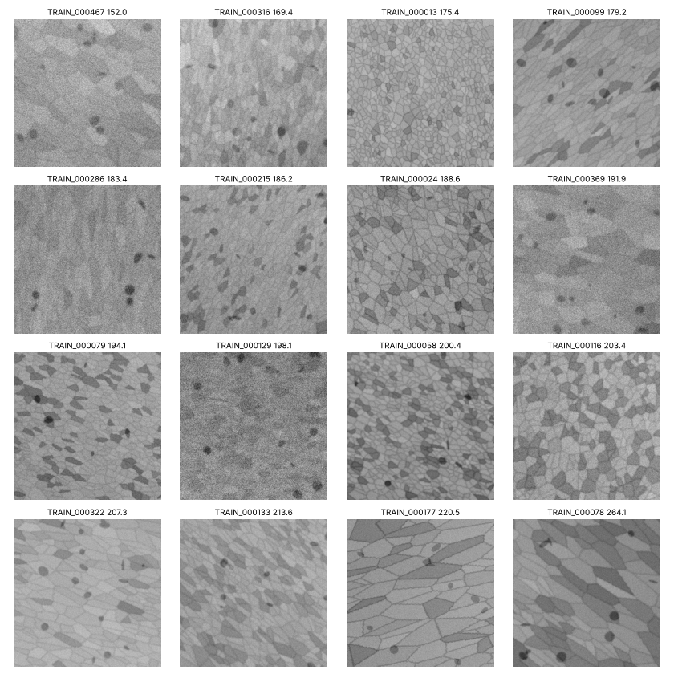
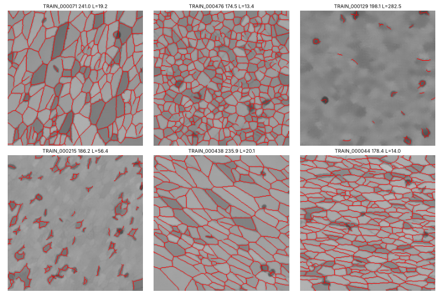

# Syn-Micro-AI

**합성 미세구조 기반 재료 물성 예측 AI 경진대회** (DACON / DAKER, 2026) 참가 기록

2D 합성 미세구조 이미지 한 장으로 재료의 **경도(hardness) 대용값**을 예측하는 회귀 문제입니다. 이 저장소에는 데이터 분석부터 특징 설계, 모델 실험, 제출까지의 과정과 코드, 그리고 무엇이 효과가 있었고 없었는지가 담겨 있습니다.

- 작성: 조종원 (스칼라윗미)
- 대회 페이지: https://daker.ai/public/hackathons/synthetic-microstructure-property-prediction-ai

---

## 1. 문제 정의

| 항목 | 내용 |
|---|---|
| 입력 | 256×256, 8비트 흑백 PNG 미세구조 이미지 1장 |
| 출력 | 경도 대용값 (HV, 연속값) |
| 데이터 | train 500장 (정답 있음), test 1,000장 |
| 평가 지표 | RMSE = sqrt(mean((예측 − 정답)²)), 낮을수록 좋음 |
| 리더보드 | Public 30% / Private 70%, 최종 순위는 Private, 최종 선택 1개 |
| 주요 규정 | train 외 외부 데이터 금지, test를 학습에 어떤 형태로도 사용 금지, 원격 API 모델 금지, 사전학습 모델은 허용 라이선스만, 1일 5회 제출 |

정답은 실제 측정값이 아니라 **Hall-Petch 관계, 상 혼합, 기공 영향**을 본떠 만든 합성값입니다(공식 참고자료). 이미지에는 다음 요소가 나타납니다.

- 결정립(다각형 알갱이)과 결정립계(어두운 선)
- 어두운 2상 결정립, 기공(검은 반점)
- 결정립 신장·정렬
- 잡음·흐림·대비·조명 얼룩

자세한 규정은 [`docs/competition_facts.md`](docs/competition_facts.md)에 있습니다.

<p align="center"><br><sub>경도 순으로 정렬한 train 이미지 예시 (왼쪽 위 152 → 오른쪽 아래 264)</sub></p>

---

## 2. 현재 결과

| 제출 | 구성 | CV RMSE | Public |
|---|---|---|---|
| 기준선 | train 평균값 | 17.68 | - |
| **1차** `sub_B_equal_blend.csv` | 구조 특징 164개 + 4개 모델 동일 가중 | 13.12 | **약 12.8** (97명 중 82위, 10/6 기준) |
| 2차 후보 `sub_BL4_feat_cnn_blend.csv` | 특징 195개 + 자체 CNN 블렌드 | 13.00 | - |
| 3차 `sub_BL5_mks_select_blend.csv` | 2점 상관·민코프스키 특징 + fold 내부 특징 선택 + CNN 블렌드 | 12.80 | 1차보다 나빠짐 |

10/6 기준 리더보드는 1위 9.24, 10위 10.77, 중앙값 약 12.2입니다.

**3차 제출의 교훈**: CV는 좋아졌는데 Public은 나빠졌습니다. 파이프라인 버그는 점검 결과 없었습니다(train/test 특징 분포, 캐시 일치, 예측 분포 확인). 300장 표본 시뮬레이션에서 우연히 나빠질 확률은 약 1%였습니다. 같은 500장으로 수십 가지 조합을 시험하고 그중 최고를 고르면서 생긴 **선택 편향(과적합)**이 가장 유력한 원인입니다. 그래서 다음 단계에서는 검증 방식부터 바꿉니다(아래 6장).

---

## 3. 파이프라인

```
이미지 ─┬─ 조명 보정 (σ=40 가우시안 배경 제거)
        ├─ 잡음 제거 (Non-Local Means)
        ├─ 결정립계 강조 (Sato 능선 필터 + Otsu 임계값)
        │
        ├─ [특징 추출] ──────────────────────────────────────────────┐
        │   v1  영상 품질·밝기 분포·기공·상 비율·경계 밀도·정렬·스펙트럼 (97)  │
        │   v2  상 덩어리 크기·신장, 기공 재정의, 다중 스케일 정렬 (67)        │
        │   v3  선형 절편법(ASTM E112) 결정립 크기, 신장도 (실험용)             │
        │   v5  결정립 크기 분포 폭, 타일 단위 공간 불균일성 (31)               │
        │   v6  2점 상관 통계(상·기공·결정립계·교차), 민코프스키 곡선 (278)     │
        │                                                                 ▼
        │                             fold 내부 특징 선택 (LightGBM 중요도 상위 K)
        │                                                                 ▼
        │                         Quantile 변환 + Ridge / SVR / ExtraTrees / LightGBM
        │
        └─ [CNN] MicroTexNet (자체 설계, 35만 파라미터, 다중 스케일 평균+표준편차 풀링)
                 입력: 원본 또는 [NLM 잡음 제거, 능선 맵]
                                                                          ▼
                                       NNLS 가중 블렌드 (fold 밖 가중치 선택으로 검증)
```

### 검증 원칙
- 타깃을 10구간으로 나눈 층화 5-fold × seed 3개. 모든 모델을 같은 fold로 비교
- 표준화, 결측 대체, 특징 선택, 타깃 정규화는 **각 학습 fold 안에서만** 학습
- 블렌드 가중치는 fold 밖에서 골라 다시 평가 (중첩 검증)
- test 이미지는 특징 계산·예측에만 사용, 학습·통계 추정에는 사용하지 않음

---

## 4. 주요 발견

### 경도와 연결된 것 (상관, 가설 단계)
| 요인 | 관계 | 비고 |
|---|---|---|
| 기지보다 약간~중간 정도 어두운 영역 (2상) | ρ ≈ +0.6 | 가장 강함. 정밀한 결정립 단위 상 비율(0.39)보다 픽셀 밝기 퍼짐 지표가 더 강함 |
| 상 지시함수의 2점 상관 (r=2~5px) | ρ ≈ +0.56 | 약 25px 거리 상관은 기존 모델 잔차와도 연결 (0.12) |
| 기공 수·면적 | ρ ≈ −0.4 | |
| 결정립 크기 분포 폭 | ρ ≈ +0.35 | 공식 참고자료 힌트와 일치 |
| 정렬·신장 정도 | ρ ≈ +0.3 | |

### 효과가 없었던 것 (데이터로 기각)
- **결정립 크기(Hall-Petch)**: 선형 절편법으로 정밀하게 측정(측정 간 일관성 높음, 결정립 수와 ρ=−0.95)했지만 경도와 상관이 거의 0이고, 다른 변수를 고정해도 효과 없음
- 정렬 **방향 각도** (방향은 고르게 분포, 경도와 무관 → 회전·반전 증강 사용 근거)
- 방향 × 정렬 결합, 기공 크기를 이용한 배율 보정, 아주 작은 기공
- 웨이블릿 산란 특징, 사전학습 ResNet18 고정 특징, 밝기 히스토그램 단독
- CNN + 특징 하이브리드 (과적합), 예측 시 8방향 TTA

<p align="center"><br><sub>NLM 잡음 제거 + 능선 검출로 찾은 결정립계 (선명한 이미지는 정확, 매우 흐린 이미지는 실패)</sub></p>

### 오류 분석
- 흐린 이미지에서 오차 16.0, 선명한 이미지 11.5
- 강하게 정렬된 이미지에서 오차가 큼 (15.9 vs 9.7)
- 양 끝값을 평균 쪽으로 당김
- **깨끗한 이미지에서도 오차가 큼** → 측정 실패만의 문제가 아니라 아직 놓친 변수나 관계가 있음

전체 실험 기록(가설, 설정, 점수, 채택 여부)은 [`docs/experiment_log.md`](docs/experiment_log.md)에 있습니다.

---

## 5. 저장소 구조

```
Syn-Micro-AI/
├── README.md
├── requirements.txt
├── docs/
│   ├── competition_facts.md     # 대회 규정·일정·공식 참고자료 요점
│   └── experiment_log.md        # 전체 실험 기록
├── src/
│   ├── cv.py                    # 공통 CV (층화 5-fold, RMSE)
│   ├── features.py              # v1 특징 + 공통 전처리
│   ├── features_v2.py           # v2 특징
│   ├── features_v3.py           # NLM 잡음 제거, 능선 경계, 선형 절편법
│   ├── features_v5.py           # 크기 분포·공간 불균일성
│   ├── features_v6.py           # 2점 상관 통계, 민코프스키 곡선
│   ├── features_hist.py, grain_phase.py, feat_scatter.py, feat_pretrained.py   # 기각된 실험
│   ├── run_*.py, make_den_cache.py   # 특징/캐시 생성
│   ├── exp_baseline.py, exp_feats.py, exp_blend.py, exp_v5.py, exp_select.py   # 모델 실험
│   ├── train_cnn.py             # 자체 CNN (MicroTexNet)
│   ├── finetune.py              # 사전학습 CNN 미세조정
│   └── blend_final.py           # 최종 블렌드 + 제출 파일 생성·검증
├── results/
│   ├── figures/                 # EDA·분할 검증 이미지
│   └── logs/                    # CNN 학습 로그, 점수 json
└── submissions/                 # 제출 파일
```

---

## 6. 재현 방법

```bash
pip install -r requirements.txt
# 1) 대회 페이지에서 open.zip을 받아 data/ 에 압축 해제
#    data/train/, data/test/, data/train.csv, data/sample_submission.csv
mkdir -p feats oof submissions
cd src

# 2) 특징 추출 (CPU 2코어 기준 합계 약 15분)
python3 run_features.py          # v1
python3 run_features_v2.py       # v2
python3 make_den_cache.py        # NLM 잡음 제거 + 능선 맵 캐시
python3 run_v5.py                # v5
python3 run_v6.py                # v6

# 3) 특징 모델
python3 exp_v5.py V1256 v1,v2,v5,v6
python3 exp_select.py

# 4) CNN (CPU 기준 각 약 25분)
python3 train_cnn.py --exp C03_cnn_w16 --seeds 42 --epochs 30 --width 16
python3 train_cnn.py --exp C04_denridge_w16 --seeds 42 --epochs 30 --width 16 --input denridge

# 5) 블렌드 + 제출 파일
python3 blend_final.py
```

- 모든 경로는 `src/` 기준 상대 경로, 인코딩 UTF-8
- `blend_final.py`가 3차 제출 파일을 동일하게 재현하는 것을 확인함
- 실험 환경: Linux, Python 3.13, CPU 2코어 / 7GB, GPU 없음. 라이브러리 버전은 `requirements.txt`
- 사전학습 가중치(`finetune.py`, `feat_pretrained.py`): timm ResNet18 (Apache 2.0, GitHub releases). 저장소에는 포함하지 않음

---

## 7. 다음 계획

1. **검증 재설계**: train 100장을 홀드아웃으로 떼어 두고, 모든 실험이 끝난 뒤 최종 확인에만 1회 사용
2. **특징 모델 단순화**: 의미가 분명한 핵심 특징 수십 개 + 모델 2~3개 동일 가중
3. **GPU로 사전학습 CNN 충분히 학습**: 원본 해상도, 회전·반전 증강, 이미지별 밝기 정규화 없음, 5-fold. 임베딩 위에 SVR 헤드 추가 (Kaggle PetFinder 상위 해법)
4. 2와 3을 단순 블렌드

---

## 참고 자료
- 대회 공식 참고자료: 「미세구조 이해를 위한 참고 자료」 (대회 페이지)
- [Data-Driven Microstructure Property Relations (arXiv 1903.10841)](https://arxiv.org/pdf/1903.10841) — 2점 상관 + 차원 축소 + 회귀
- [Structure-property modeling by two-point statistics and PCA](https://www.oaepublish.com/articles/jmi.2022.05)
- [Predicting Resistivity and Permeability of Porous Media Using Minkowski Functionals](https://link.springer.com/article/10.1007/s11242-019-01363-2)
- [Deep Learning-Driven Microstructure Characterization and Vickers Hardness Prediction of Mg-Gd Alloys](https://arxiv.org/html/2410.20402v1)
- [PetFinder Pawpularity 1st Place Solution (embeddings + SVR)](https://www.kaggle.com/competitions/petfinder-pawpularity-score/writeups/giba-rapids-svr-magic-1st-place-winning-solution-p)

> 대회 데이터(`open.zip`)는 재배포하지 않습니다. 대회 페이지에서 참가 신청 후 직접 받아야 합니다.
